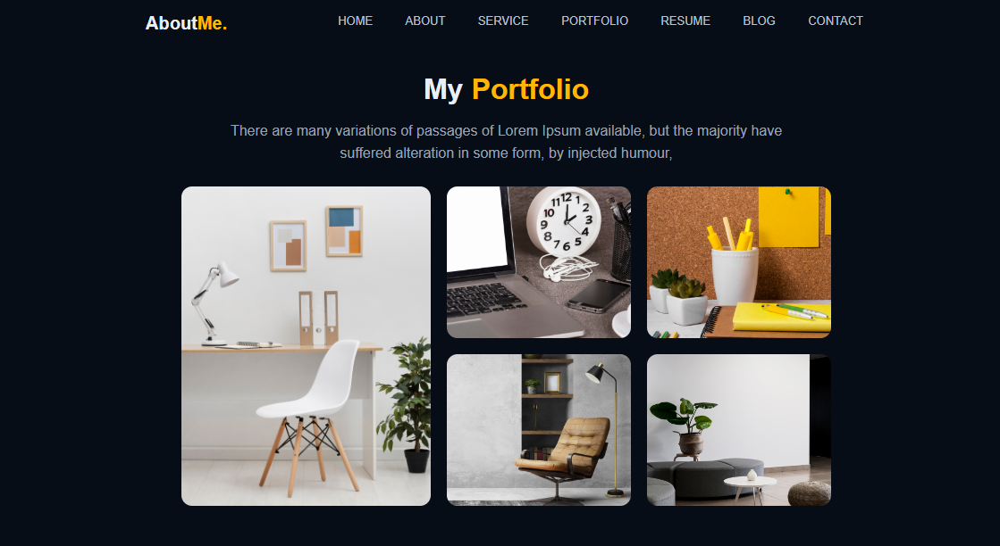

# 🌐 Personal Portfolio Website

This is my personal portfolio website built using **HTML** and **CSS**.  
It displays my work, services, and skills in a modern and responsive design.

---

## 📸 Screenshots

### 🏠 Home Page

### ℹ️ About Me

### 🛠️ Services

### 🎨 Portfolio

###  Experiences

### Contact 

###

---

## 🛠️ Technologies Used
- **HTML5** → Structure of the website
- **CSS3** → Styling and colors
- **CSS Variables** → For managing colors easily
- **Flexbox** and **CSS Grid** → For layout design
